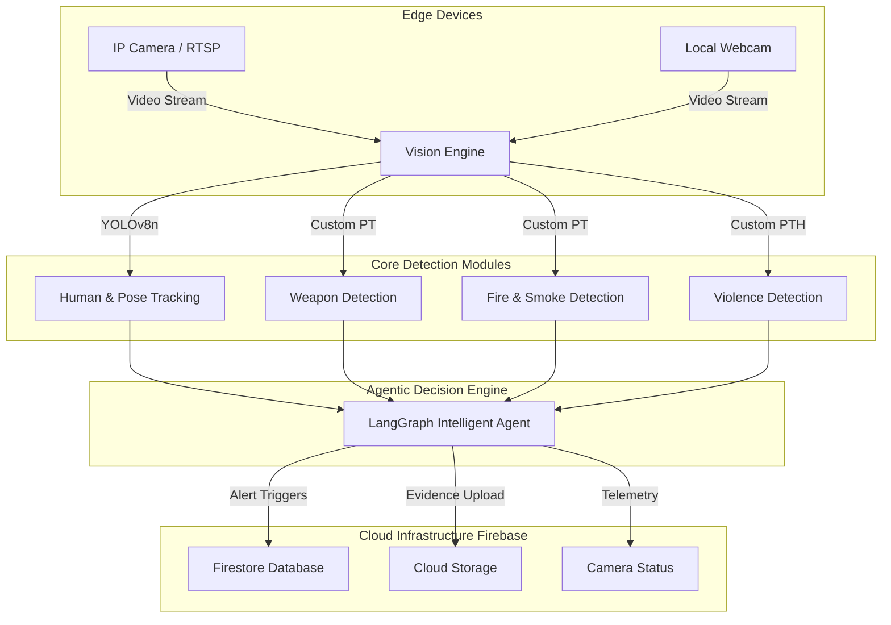

<div align="center">
  
# 🦅 Skywatch System
**Next-Generation Autonomous Surveillance & Threat Intelligence Engine**

[](https://www.python.org/downloads/)
[](https://ultralytics.com)
[](https://www.langchain.com/langgraph)
[](https://firebase.google.com/)
[](https://opensource.org/licenses/MIT)

[Explore Repository](https://github.com/ShakeelRana624/skywatch) • [Report Bug](https://github.com/ShakeelRana624/skywatch/issues) • [Request Feature](https://github.com/ShakeelRana624/skywatch/issues)

</div>

---

## 📖 Table of Contents
- [Executive Summary](#-executive-summary)
- [System Architecture](#-system-architecture)
- [Core Capabilities](#-core-capabilities)
- [Technology Stack](#-technology-stack)
- [Prerequisites & Hardware](#-prerequisites--hardware)
- [Installation & Deployment](#-installation--deployment)
- [Model Weights & Configuration](#-model-weights--configuration)
- [Directory Structure](#-directory-structure)
- [Usage](#-usage)

---

## 🌐 Executive Summary

**Skywatch System** is an enterprise-grade, hybrid artificial intelligence decision engine engineered for real-time threat detection and autonomous surveillance. Moving beyond traditional CCTV monitoring, Skywatch fuses state-of-the-art Computer Vision (YOLOv8, DeepSORT) with Large Language Model (LLM) agentic workflows (LangGraph & LangChain). 

This allows the system not only to detect anomalies like weapons, physical altercations, and fire, but also to contextually analyze situations, trigger multi-stage alerts, and securely vault critical evidence directly to the cloud (Firebase).

---

## 🏗️ System Architecture

The hybrid architecture guarantees rapid edge-inference combined with cloud-scale logging.



---

## ⚡ Core Capabilities

- **Autonomous Threat Recognition**: Real-time detection of firearms, melee weapons, and suspicious objects.
- **Behavioral & Kinematic Analysis**: Spatial tracking of human skeletons to identify aggressive postures, brawls, and unauthorized activities using DeepSORT.
- **Environmental Hazard Detection**: Instant identification of nascent fires and smoke clouds to prevent catastrophic damage.
- **Cognitive Agent Engine**: Employs LangGraph to cross-reference multiple detection signals (e.g., *Is a person running while holding a weapon?*) to eliminate false positives and escalate alerts dynamically.
- **Cloud-Native Evidence Vault**: Seamlessly pushes critical video frames and metadata to Firebase for immutable forensic records.

---

## 🛠️ Technology Stack

| Domain | Technologies Used |
| :--- | :--- |
| **Computer Vision** | OpenCV, Ultralytics YOLOv8, DeepSORT |
| **Deep Learning** | PyTorch, TorchVision |
| **Agentic AI** | LangChain, LangGraph, OpenAI |
| **Cloud & Database** | Firebase Admin SDK, Google Cloud Storage, Firestore |
| **Concurrency** | AsyncIO, AnyIO, WebSockets |

---

## 💻 Prerequisites & Hardware

- **Operating System:** Windows 10/11, Ubuntu 20.04+, or macOS.
- **Python:** Version 3.10 or higher.
- **Hardware Acceleration:** NVIDIA GPU with CUDA support (Highly Recommended for real-time 30+ FPS processing). Minimum 8GB VRAM.
- **Cloud:** An active Google Firebase project with a Service Account Key.

---

## 🚀 Installation & Deployment

### 1. Clone the Repository
```bash
git clone https://github.com/ShakeelRana624/skywatch.git
cd skywatch/Skywatch-System
```

### 2. Isolate Environment
Create and activate a Python virtual environment to prevent dependency conflicts:
```bash
# Windows
python -m venv venv
venv\Scripts\activate

# Linux / macOS
python3 -m venv venv
source venv/bin/activate
```

### 3. Install Dependencies
Install all core AI, LangGraph, and Firebase dependencies:
```bash
pip install -r requirements.txt
```

### 4. Authenticate Firebase
1. Navigate to your Firebase Console → Project Settings → Service Accounts.
2. Generate a new private key (`.json`).
3. Save this file to the root of the project as `serviceAccountKey.json`.
> **⚠️ CRITICAL:** Never commit `serviceAccountKey.json` to GitHub.

---

## 🧠 Model Weights & Configuration

For the system to function, pre-trained AI weights must be placed in specific directories. 

**Root Directory (`Skywatch-System/`):**
* `yolov8n.pt` *(Base YOLOv8 Nano for tracking)*
* `yolov8s-pose.pt` *(YOLOv8 Small for Pose Estimation)*

**Models Directory (`Skywatch-System/models/`):**
* `best.pt` *(Core Integrated System Model)*
* `gun.pt` *(Weapon Detection Specific Model)*
* `fire-smoke.pt` *(Environmental Hazard Detection)*
* `best_model_fold_3.pth` *(Violence/Fight Detection PyTorch Model)*
* `yolov8n-pose.pt` *(Fallback pose model)*

---

## 📂 Directory Structure

```text
📦 Skywatch-System
 ┣ 📂 agents               # LangGraph/LangChain cognitive decision agents
 ┣ 📂 core                 # System orchestrators and entry protocols
 ┣ 📂 detection            # Base YOLO detection and DeepSORT tracking logic
 ┣ 📂 fight_detection      # Kinematic violence and altercation detection
 ┣ 📂 explosion            # Neural networks for fire and smoke recognition
 ┣ 📂 firebase_alerts      # Secure Cloud Firestore data pushers
 ┣ 📂 firebase_evidence    # Evidence image/video payload handlers (Cloud Storage)
 ┣ 📂 models               # Repository for compiled .pt and .pth weight files
 ┣ 📂 utils                # System utilities, telemetry, and memory managers
 ┣ 📜 main.py              # Primary Application Entry Point
 ┣ 📜 requirements.txt     # Python environment requirements
 ┗ 📜 README.md            # System Documentation
```

---

## 🕹️ Usage

To initialize the Skywatch surveillance orchestrator, run:

```bash
python main.py
```

### Expected Initialization Sequence:
1. System validates Firebase service credentials.
2. Neural networks load into VRAM/RAM.
3. LangGraph agent nodes are instantiated.
4. Real-time stream processing begins. Output metrics and logs are piped to the terminal and Firebase dashboard.

---

<div align="center">
  <p>Engineered by <a href="https://github.com/ShakeelRana624">Shakeel Rana</a></p>
  <p>Protected by MIT License • Copyright &copy; 2024-2026</p>
</div>
